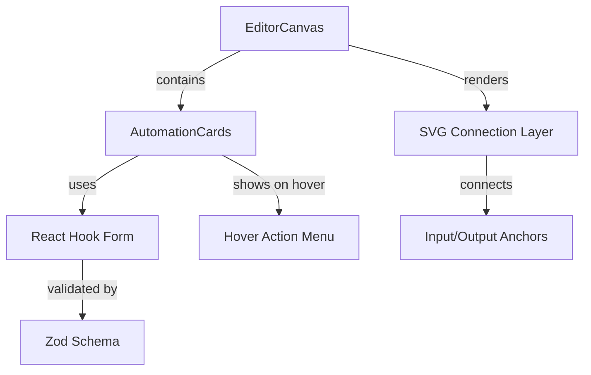

# Automation Node Editor Project Plan

This plan outlines the creation of a custom node editor for automation sequences. The project will use a modern stack focused on performance, type safety, and developer experience.

## 1. Project Initialization and Tooling

- Initialize a **Vite** project with **React** and **TypeScript** using **pnpm**.
- Configure **Biome** for linting and formatting (replaces ESLint/Prettier).
- Setup **Tailwind CSS v3** for styling.
- Initialize **Shadcn UI** using `npx shadcn@latest init` for core UI atoms.
- Handle Vite configuration with potential multi-file spread (e.g., `vite.config.ts`, `postcss.config.js`, `tailwind.config.ts`).
- Initialize **Storybook** for component development and documentation.

## 2. Core Architecture

- **State Management:** Use a central store (e.g., Zustand or simple Context) to track node positions and connections.
- **Drag and Drop:** Implement `@dnd-kit/core` to handle card movement within a "Canvas" container.
- **Node Data Schema:** Define Zod schemas for Node data and Connection data.

## 3. Automation Card Component

A specialized component representing a step in the automation.

### Features:

- **Header:** Title and Description.
- **Body:** **React Hook Form** with 3 text fields, validated by **Zod**.
- **Hover Menu:** A floating menu above the card with 3 **Lucide React** icon buttons.
- **Anchors:** Inbound connection point (top/left) and a list of outbound connection points (bottom/right).

## 4. Connection System (Arrows)

- Implement a custom SVG layer that renders paths between node anchors.
- Paths will be calculated dynamically based on node coordinates.
- Support for "New Connection" logic from the outbound list.

## 5. Implementation Roadmap

### Phase 1: Setup & Design System

- Initialize project with `pnpm create vite`.
- Setup Biome and Tailwind 3.
- Initialize Shadcn UI and install required atoms (Button, Input, Card, etc.).
- Configure Vite multi-file setup as needed.

### Phase 2: The Automation Card

- Build the `AutomationCard` component.
- Implement the hover state and action menu.
- Integrate `react-hook-form` inside the card.

### Phase 3: Canvas & Dnd

- Create the `EditorCanvas` component.
- Implement dragging logic using `dnd-kit`.
- Add zoom/pan support (optional but recommended for node editors).

### Phase 4: Connections & Logic

- Develop the `ConnectionLine` component (SVG paths).
- Implement state logic to manage node-to-node relationships.
- Add **React Query** for persisting the automation sequence to a mock API.

### Phase 5: Documentation

- Add Storybook stories for `AutomationCard` and `EditorCanvas`.

## Visual Flow (Mermaid)

